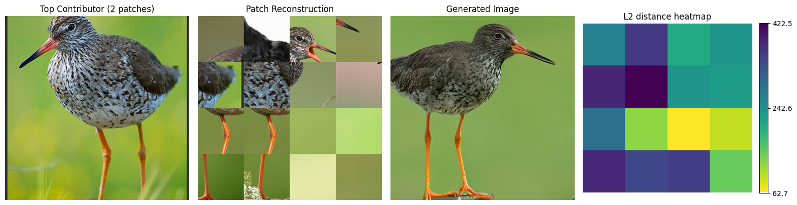

# Experiment to investigate the Recombination Hypothesis

## CONCLUDED

This experiment likely has some conceptual limitations. Specifically:
- The patching approach is very ineffecient, as the patch size fixes a scale of patterns that we can detect. In 
reality, diffusion models likely recombine patterns at different scales.
- The concept of a "pattern" might be more abstract than literal pixel-level or feature-level copying
- Naive patching is unlikely to capture a pattern in a way that a human does when we look at images and spot
similarities. Patches practically always combine different patterns of different scales, making a clean "match" between
patches extremely unlikely.

---

## Hypothesis
Diffusion models achieve diversity (which appears like generalization) through the recombination of learned patterns. 
Additionally, whereas local textures can be learned, more complicated (more global) patterns tend to be memorized, 
as they are more image-specific and thus harder to generalize. This recombination-behavior is distinctly different from 
how other generative models generalize, perhaps most contrasted by VAEs, which exhibit interpolation-like generalization.

## Approach
Examine patch embeddings of generated images by comparing them to the patch embeddings of training images. Compare 
results between a diffusion model (EDM2) and a VAE (Visual-VAE).

## Experimental Pipeline

1. **Choose generative models, dataset and feature extractors:**
   - Diffusion Models: EDM2 models of varying sizes (XS, S, M, L, XL) on both IN64 and IN512 resolutions
   - Comparative Model: Visual-VAE on IN64 (limited by VAE capability for high-resolution generation)
   - Feature Extractors: DINOv2 (ViT-L/14), SwAV (ResNet-50), and LPIPS (AlexNet and VGG16 backbones)

2. **Extract patch embeddings** from training and generated images, resulting in tensors of shape (n_images, n_patches, embedding_dimension) 
for different configurations: 16 patches (4x4 grid) or 64 patches (8x8 grid)

3. **Run nearest neighbor search** using the FAISS library and batch-processing to efficiently perform GPU-accelerated similarity search.
Math generative embeddings to training embeddings using both L2 distance and cosine similarity metrics. 
Store "indices" and "distances" tensors containing the nearest training patch for each generated patch.

4. **Analyze and visualize results**

## Evaluations

1. **Statistical Metrics:**
   - Patch origin histogram: Distribution of source training images for generated patches
   - Patch origin entropy: Measure of selectivity in training image usage (higher = more selective)
   - Unique source count: Number of unique training images contributing patches
   - Mean/median patch distances: Overall similarity between generated and training patches

2. **Distance Analysis:**
   - Patch distance histograms: Distribution of nearest neighbor distances
   - Per-image average distance histograms: Average patch distances grouped by generated image
   - Cross-model comparisons: Distance distributions between different model sizes and types

3. **Visualizations:**
   - Colored patch maps: Generated images with patches colored by source training image
   - Patch replacement visualizations: Generated images with patches replaced by nearest training patches
   - Top contributor analysis: Generated images paired with their most-used training image source
   - Distance-based selection: Visualization of generated images with lowest/highest average patch distances

## Script Descriptions

### extract_patch_features.py
This script extracts patch-level embeddings from both training and generated images. It loads images batch-wise from 
datasets (zip files or directories), divides each image into a grid of patches (configurable size), and passes patches 
through a feature extractor (SwAV, DINOv2, or LPIPS). The script stores the resulting embeddings as tensor files, 
supports checkpoint saving for resuming large extraction jobs, and scales to handle datasets with millions of images. 
Different resizing strategies are used depending on the feature extractor, with DINOv2 using 448px, SwAV using 224px, 
and LPIPS using 512px as the base resolution.

### experiments.py
This script runs analysis and visualizations on the extracted patch embeddings. It loads extracted features from both 
training and generated images, constructs FAISS indices for efficient similarity search, and computes nearest neighbors 
between generated and training patches. The script calculates statistical metrics (entropy, unique counts, distances) 
and generates visualizations of patch origins and replacements. It supports different distance metrics (L2, cosine) and 
can process results for different model sizes and types.

### Bash Scripts

#### extract_patch_features.sh
This script automates feature extraction across multiple configurations. It processes training datasets in batches 
(100K-500K images), configures different patch counts (16, 64), supports multiple feature extractors (SwAV, DINOv2, 
LPIPS-Alex, LPIPS-VGG), and handles both training and generated images from various model types and sizes.

#### experiments.sh
This script automates the analysis pipeline by running experiments with different similarity metrics (L2, cosine), 
processing results for different generative models, and configuring dataset sizes and feature model combinations. 
It allows batch processing of different experimental configurations with minimal manual intervention.

## Results
The patch origin histogram and patch origin entropy show that EDM uses a larger number of different training images, 
while the VAE is more selective. The distance histogram shows a stark difference between the models, with EDM having 
much closer matches, overall and on average. This could be explained by memorization or the superior image quality of 
EDM. 

The various feature extractors show differences, with DINOv2 showing the best performance in the visual analysis.
Patch matches are the most semantically meaningful, focusing less on textures and more on object semantics.

## Follow-up Experiments

After initial experiments with DINOv2, we implemented SwAV as a feature detector because it can process patches 
independently without contextualizing them with the rest of the image, and its inductive bias allows it to embed 
patches (local crops) without seeing the rest of the image.

For a more perceptual comparison, we also added LPIPS feature extractors (both AlexNet and VGG16 backbones) which are 
specifically designed to capture perceptual similarities in images. These features are weighted according to the 
LPIPS model's learned perceptual importance. 

Despite trying multiple feature extractors, patch configurations, and distance metrics, results still don't make 
intuitive sense - nearest neighbor patches practically never visually resemble each other and show no interpretable
patterns, besides color. Entropy measurements remain almost constant across models.

## Problems and Limitations

### Conceptual Limitations

1. **The Recombination Hypothesis Itself**:
   - The hypothesis assumes that diffusion models reuse "patterns" from training data. However, the concept of a "pattern" might be more abstract than literal pixel-level or feature-level copying
   - The model might be learning to generate similar statistical properties rather than reusing exact patches

2. **Scale of Patterns**:
   - The current approach assumes patterns exist at the patch level
   - However, the meaningful patterns might exist at multiple scales simultaneously
   - A patch-based approach might be too rigid to capture this multi-scale nature

3. **Feature Space vs. Generation Space**:
   - We're trying to find similarities in feature space (LPIPS, DINOv2, SwAV)
   - But the diffusion model operates in noised pixel space
   - The features we're comparing might not represent the space where actual pattern reuse occurs

### Model Performance Disparities
EDM2 has vastly superior generative performance (FID/FDD) compared to VAEs, which biases nearest neighbor results. 
Both NN distance (due to better image quality) and patch origin entropy (due to better distribution coverage) are 
affected by this. Finding evenly matched models is challenging, as few VAEs can match diffusion model performance at 
high resolutions. The assumption of interpolation-style generalization in VAEs is crucial for comparing generalization 
mechanisms, leaving no other choices.

### Matching Image or Patch to Model Scale
Working with 16 or 64 patches per image results in very small patches, especially at lower resolutions, which networks 
have never seen during training. Upscaling each patch to the "native" image resolution fixes that, but presents an 
unnatural image-scale to the network, that it also has never seen during training. This always leaves the problematic 
tradeoff between matching a model's inductive bias (scaling the entire image) and matching a model's expected image 
scale (scaling the patches). Additionally, upscaling from small image resolutions, e.g., on IN64, introduces upscaling 
artifacts.

### Feature Extraction Limitations
- LPIPS uses feature vectors from multiple network depths. This leads to a huge amount of feature data per patch (~150k
vs 1k for DINOv2 and 2k for SwAV). The remedy this limitation, we average over the spatial dimension before storing,
resulting in ~1k features per patch. This removes the "where" information for each patch, but keeps the "what", which
suits our usecase. Problematic might be that the feature weighting was learned on the regular features without averaging.
- DINOv2 contextualizes patches with the entire image, biasing the search for "reused" patches. 
- (DINOv2 and SwAV) Using the last layer features may be too abstract for texture-level analysis. 
- Unnormalized features with L2 distance make search sensitive to magnitude differences. 
- Memory constraints limit the number of training and generated samples that can be processed. 
- I/O errors can occur when reading from large zip files (e.g., 1TB ImageNet-512).

### Computational Challenges
Nearest neighbor search scales poorly with dataset size (linear in n_gen, n_train and n_patches). FAISS helps with GPU 
acceleration but still requires batch processing for large datasets. Storing intermediate results is storage-intensive. 
Processing the full ImageNet dataset requires significant time and computational resources.

### Technical Improvements
Use larger crops (32x32 or larger) that better align with feature extractor training. Implement fully convolutional 
architectures with fixed upscaling ratios. Use normalized features with appropriate distance metrics (L2 for normalized 
features or cosine similarity). Extract features from middle layers that may better represent textures and patterns. 
Implement chunked file reading to handle large zip files without I/O errors. Compare models of similar generative 
quality to isolate recombination effects from quality differences.

## Future Directions

## Outlook
Alternative approaches to investigate the hypothesis could include:

1. **Distribution Analysis**:
   - Instead of looking for exact matches, analyze the distribution of features
   - Compare the statistical properties of patches between generated and training images
   - This could reveal if the model is maintaining similar statistics without exact copying

2. **Hierarchical Analysis**:
   - Look at patterns at multiple scales simultaneously
   - Use feature pyramids or hierarchical representations
   - This could capture both local textures and larger structural patterns

3. **Latent Space Analysis**:
   - Study the model's internal representations during generation
   - Analyze how the denoising process builds up patterns
   - This might reveal more about how the model actually constructs images

The current approach might be too literal in its search for pattern reuse, when the reality of how diffusion models 
generalize could be more subtle and statistical in nature.
